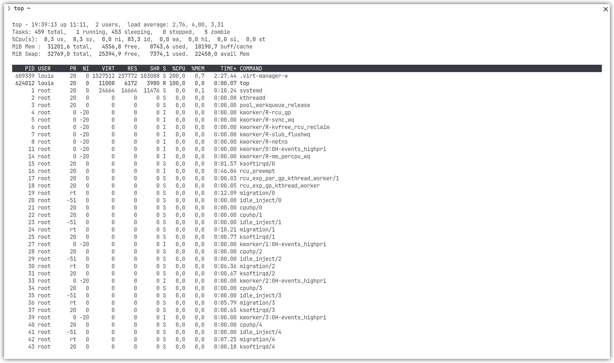

> 💡 Question 1 : Si l’un des tests échoue à cause d’un bug, comment pytest signale-t-il l’erreur et aide-t-il à la localiser ? Rédigez un test qui provoque volontairement une erreur, puis montrez la sortie du terminal obtenue.

```
❯ python3 -m pytest
================================================================================= test session starts ==================================================================================
platform linux -- Python 3.13.6, pytest-8.4.1, pluggy-1.6.0
rootdir: /home/louis/src/log430-a25-labo0/src
collected 11 items

tests/test_calculator.py ..........F                                                                                                                                             [100%]

======================================================================================= FAILURES =======================================================================================
______________________________________________________________________________________ test_fail _______________________________________________________________________________________

    def test_fail():
        a = 5
>       assert a == 2
E       assert 5 == 2

tests/test_calculator.py:62: AssertionError
=============================================================================== short test summary info ================================================================================
FAILED tests/test_calculator.py::test_fail - assert 5 == 2
============================================================================= 1 failed, 10 passed in 0.03s =============================================================================
```

Pytest signale que le test concerné a échoué en précisant la nature de l'échec. Dans cet exemple, `a` est remplacé par sa valeur au moment de l'exécution du test qui est différente de `2`.

> 💡 Question 2 : Que fait GitLab pendant les étapes de « setup » et « checkout » ? Veuillez inclure la sortie du terminal Gitlab CI dans votre réponse.

Le `checkout` sert à cloner le dépôt Git dans l'environnement de CI et le `setup-python` sert à y installer python.

```
Run actions/checkout@v3
Syncing repository: louis-thevenet/log430-a25-labo0
Getting Git version info
Temporarily overriding HOME='/home/runner/work/_temp/7c8ae206-068c-4371-807b-6013cec6118e' before making global git config changes
Adding repository directory to the temporary git global config as a safe directory
/usr/bin/git config --global --add safe.directory /home/runner/work/log430-a25-labo0/log430-a25-labo0
Deleting the contents of '/home/runner/work/log430-a25-labo0/log430-a25-labo0'
Initializing the repository
Disabling automatic garbage collection
Setting up auth
Fetching the repository
Determining the checkout info
Checking out the ref
/usr/bin/git log -1 --format='%H'
'8347c7e21956c899c710c5f144484b20c09051e3'
```

```
Run actions/setup-python@v4
  with:
    python-version: 3.11
    check-latest: false
    token: ***
    update-environment: true
    allow-prereleases: false
Installed versions
  Successfully set up CPython (3.11.13)
```

> 💡 Question 3 : Quelle approche et quelles commandes avez-vous exécutées pour automatiser le déploiement continu de l'application dans la machine virtuelle ? Veuillez inclure les sorties du terminal et les scripts bash dans votre réponse.

On ne peut pas accéder à la machine virtuelle depuis les GitHub actions à cause du VPN. J'ai créé un script d'installation `./install.sh`.
Il suffirait de lancer la commande `sudo curl https://raw.githubusercontent.com/louis-thevenet/log430-a25-labo0/refs/heads/main/install.sh | sh` via SSH depuis une GitHub action.

Le script arrête l'instance précédente, clone le dépôt et installe les dépendances. Il lance finalement l'application.

```bash
#!/usr/bin/env bash

set -e
pkill -f "calculator.py" || true

cd ~
rm -rf log430-a25-labo0
git clone https://github.com/louis-thevenet/log430-a25-labo0.git
cd  log430-a25-labo0/

sudo apt -y install python3 python3-venv
python3 -m venv .venv/labo0
source .venv/labo0/bin/activate

pip install -r requirements.txt

cd src/
python3 calculator.py
```

> 💡 Question 4 : Quel type d'informations pouvez-vous obtenir via la commande « top » ? Veuillez inclure la sortie du terminal dans votre réponse.

Le programme top permet d'afficher l'état du système en temps réel, il affiche entre autres la liste des processus en cours d'exécution, des information sur leur propriétaire, PID, ainsi que l'utilisation du CPU et de la mémoire.


